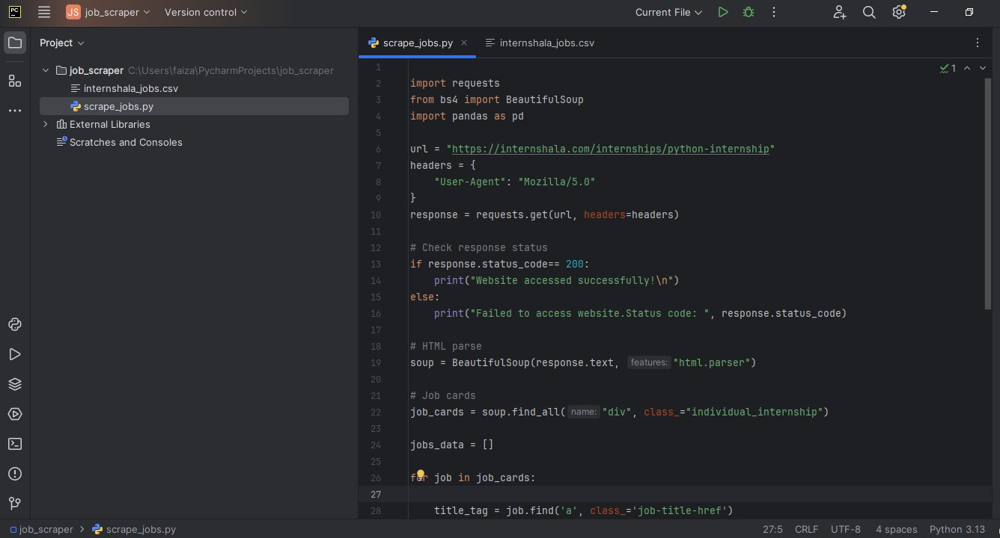
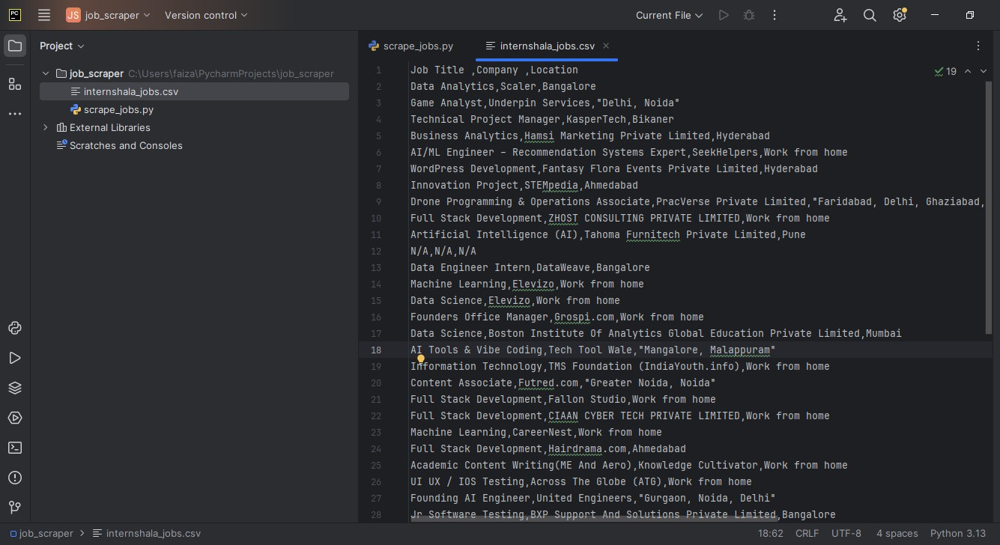

# Internshala Web Scraper

This is a simple web scraping project using Python to extract internship data
(Job Title, Company Name, Location) from [Internshala](https://internshala.com).

## What it does

The script sends a request to the Internshala internships page, parses the HTML 
using BeautifulSoup, and extracts:
- Job Title
- Company Name
- Location

The data is saved in a clean and structured .csv file using Pandas.

##  Tools & Libraries Used
- Python 3
- Requests
- BeautifulSoup
- Pandas

## Output
The data is stored in a file named internshala_jobs.csv, with clean formatting and 
readable columns.

##  Future Improvements
- Scrape multiple pages
- Add more fields like job link, stipend, etc.
- Build a UI to view jobs in real-time

##  Screenshot
Add screenshots of your code/input and output below:




##  How to Run

1. Install required libraries:

```bash
pip install requests beautifulsoup4 pandas